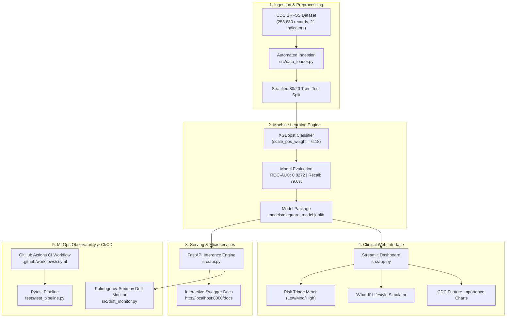

# 🛡️ DiaGuard: Diabetes Risk Assessment & Counterfactual Guidance

[](https://python.org)
[](https://fastapi.tiangolo.com)
[](https://streamlit.io)
[](https://xgboost.readthedocs.io)
[](https://docker.com)
[](https://github.com/features/actions)

**DiaGuard** is an end-to-end, production-grade Machine Learning system designed for **population-level diabetes risk assessment and personalized lifestyle guidance**. 

Trained on the official **CDC Behavioral Risk Factor Surveillance System (BRFSS)** dataset of **253,680 patient records**, DiaGuard couples high-recall predictive modeling with **counterfactual simulation**—empowering patients and clinicians to see how specific lifestyle modifications (such as reducing BMI, controlling blood pressure, or adopting routine exercise) directly lower diabetes risk.

---

## 🏛️ System Architecture



---

## 📊 Dataset & Model Performance

### Dataset Overview
* **Source:** Centers for Disease Control and Prevention (CDC) — Behavioral Risk Factor Surveillance System (BRFSS)
* **Sample Size:** 253,680 patient survey encounters
* **Features:** 21 physiological, demographic, and behavioral health indicators
* **Class Imbalance:** ~14% positive cases (handled via cost-sensitive learning with `scale_pos_weight = 6.18`)

### Test Set Performance (50,736 Holdout Patients)

| Metric | Score | Clinical Interpretation |
| :--- | :--- | :--- |
| **ROC-AUC** | **`0.8272`** | Strong discrimination between healthy individuals and diabetic/pre-diabetic cases |
| **Recall (Sensitivity)** | **`79.59%`** | **Critical for healthcare screening:** Catches ~8 out of 10 at-risk individuals |
| **Accuracy** | **`72.14%`** | Calibrated screening baseline on real-world imbalanced population |
| **Latency** | **`< 25 ms`** | Real-time scoring suitable for instant web and mobile triage |

---

## 🌟 Key Features

1. **Patient Risk Scoring (`/api/v1/predict`):**
   * Inputs 21 indicators and computes calibrated risk probability.
   * Classifies individuals into 4 clinical tiers: *Low Risk*, *Moderate Risk*, *Elevated Risk*, and *High Risk*.
2. **Counterfactual "What-If" Guidance (`/api/v1/simulate-what-if`):**
   * Computes the exact relative and absolute risk reduction achievable when a patient modifies their BMI, adopts exercise, or controls blood pressure.
3. **Statistical Drift Observability (`src/drift_monitor.py`):**
   * Automatically executes 2-sample Kolmogorov-Smirnov tests to detect demographic and physiological data drift in incoming patient batches.
4. **Production Architecture:**
   * Pydantic data schemas rejecting invalid vitals (e.g. negative BMI or out-of-range ages).
   * Fully containerized with Docker & Docker Compose.
   * Automated unit and integration testing with `pytest`.

---

## 🚀 Quickstart & How to Run

### Option 1: Native Local Run (Recommended for Development)

1. **Install Dependencies:**
   ```bash
   pip install -r requirements.txt
   ```

2. **Download Data & Train Model (Runs in ~20 seconds):**
   ```bash
   python src/data_loader.py
   python src/train.py
   ```

3. **Run the Interactive Web App:**
   ```bash
   streamlit run src/app.py
   ```
   *Open your browser at `http://localhost:8501`*

4. **Run the FastAPI Backend Server:**
   ```bash
   uvicorn src.api:app --reload --port 8000
   ```
   *Explore the interactive API docs at `http://localhost:8000/docs`*

5. **Run Automated Tests & Drift Monitor:**
   ```bash
   pytest tests/ -v
   python src/drift_monitor.py
   ```

---

### Option 2: Docker Compose Deployment

Run the entire multi-service stack with a single command:
```bash
docker compose up --build
```
* **Frontend Web App:** `http://localhost:8501`
* **FastAPI Docs:** `http://localhost:8000/docs`

---

## 📁 Repository Structure

```text
├── .github/
│   └── workflows/
│       └── ci.yml               # Automated CI/CD test pipeline
├── data/
│   └── raw/                     # Versioned CDC epidemiological dataset
├── models/
│   ├── diaguard_model.joblib    # Serialized XGBoost model bundle (327 KB)
│   ├── evaluation_metrics.json  # Holdout test metrics
│   └── drift_report.json        # Data drift monitoring logs
├── src/
│   ├── data_loader.py           # Automated dataset fetcher (UCI repo)
│   ├── train.py                 # Training script with class-weighting & evaluation
│   ├── api.py                   # FastAPI REST backend with Pydantic validation
│   ├── app.py                   # Streamlit web application & What-If simulator
│   └── drift_monitor.py         # Kolmogorov-Smirnov drift detection service
├── tests/
│   └── test_pipeline.py         # Pytest unit & integration test suite
├── Dockerfile                   # Multi-service container specification
├── docker-compose.yml           # Local multi-container orchestration
├── requirements.txt             # Pinned project dependencies
└── README.md                    # Project documentation
```

---

## 👩‍💻 Author
**Anya Kumar**  
B.Tech in Computer Science & Engineering (AI/ML Specialization)
